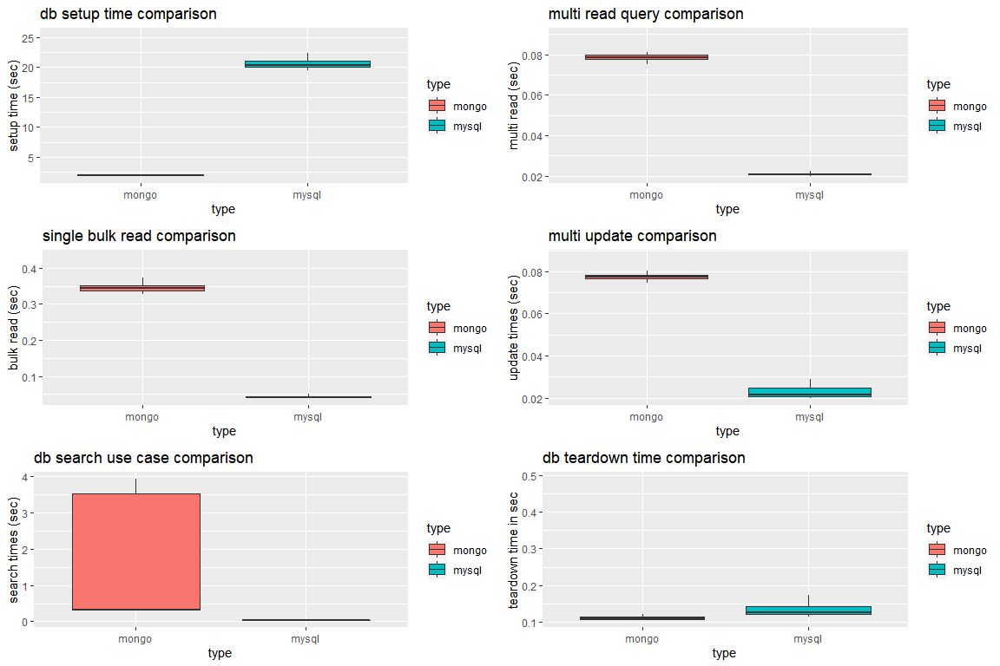

## Data Cleanup

First, we load and prep csv data from benchmark the test for visualization.


```r
# Read Data
mongo.benchmarks <- read.csv('RESULTS_MDB_R.csv', header = TRUE, sep = ",")
mysql.benchmarks <- read.csv('RESULTS_MSQL_R.csv', header = TRUE, sep = ",")

# Remove row with repeated headers
mongo.clean <- mongo.benchmarks[!grepl(".csv", mongo.benchmarks$X011.MONGO.setup.csv),]
mysql.clean <- mysql.benchmarks[!grepl(".csv", mysql.benchmarks$X021.MYSQL.setup.csv),]

# Rename Columns
new.cols <- c('setup', 'multi.read', 'single.bulk.read', 'multi.discount.update', 'search.discounted', 'teardown')
colnames(mysql.clean) <- new.cols
colnames(mongo.clean) <- new.cols

mysql.clean[sapply(mysql.clean, is.factor)] <- lapply(mysql.clean[sapply(mysql.clean, is.factor)], function(x) as.numeric(as.character(x)))
mongo.clean[sapply(mongo.clean, is.factor)] <- lapply(mongo.clean[sapply(mongo.clean, is.factor)], function(x) as.numeric(as.character(x)))

mongo.clean$type <- rep("mongo", nrow(mongo.clean))
mysql.clean$type <- rep("mysql", nrow(mysql.clean))


# Create a common data set
benchmark.all <- rbind(mongo.clean, mysql.clean)
benchmark.all$multi.read <- benchmark.all$multi.read/500
benchmark.all$multi.discount.update <- benchmark.all$multi.discount.update/500
```

## Data Visuals

### Boxplot across data distribution by use case by db


```r
boxplot.setup <- ggplot(benchmark.all, aes(type, setup,  fill=type), na.rm = T) + geom_boxplot(na.rm = T, outlier.shape = NA) + ggtitle("setup") + scale_y_continuous(limits = quantile(benchmark.all$setup, c(0.1, 0.9), na.rm = T)) + ggtitle("db setup time comparison") + ylab("setup time (sec)")
boxplot.multi.read <- ggplot(benchmark.all, aes(type, multi.read,  fill=type), na.rm = T) + geom_boxplot(na.rm = T, outlier.shape = NA) + ggtitle("multi.read") + scale_y_continuous(limits = quantile(benchmark.all$multi.read, c(0.1, 0.9), na.rm = T))  + ggtitle("multi read query comparison") + ylab("multi read (sec)")
boxplot.single.bulk.read <- ggplot(benchmark.all, aes(type, single.bulk.read,  fill=type), na.rm = T) + geom_boxplot(na.rm = T, outlier.shape = NA) + ggtitle("single.bulk.read") + scale_y_continuous(limits = quantile(benchmark.all$single.bulk.read, c(0.1, 0.9), na.rm = T)) + ggtitle("single bulk read comparison") + ylab("bulk read (sec)")
boxplot.multi.discount.update <- ggplot(benchmark.all, aes(type, multi.discount.update,  fill=type), na.rm = T) + geom_boxplot(na.rm = T, outlier.shape = NA) + ggtitle("multi.discount.update") + scale_y_continuous(limits = quantile(benchmark.all$multi.discount.update, c(0.1, 0.9), na.rm = T)) + ggtitle("multi update comparison") + ylab("update times (sec)")
boxplot.search.discounted <- ggplot(benchmark.all, aes(type, search.discounted,  fill=type), na.rm = T) + geom_boxplot(na.rm = T, outlier.shape = NA) + ggtitle("search.discounted") + scale_y_continuous(limits = quantile(benchmark.all$search.discounted, c(0.1, 0.9), na.rm = T)) + ggtitle("db search use case comparison") + ylab("search times (sec)")
boxplot.teardown <- ggplot(benchmark.all, aes(type, teardown,  fill=type), na.rm = T) + geom_boxplot(na.rm = T, outlier.shape = NA) + ggtitle("teardown") + scale_y_continuous(limits = quantile(benchmark.all$teardown, c(0.1, 0.9), na.rm = T)) + ggtitle("db teardown time comparison") + ylab("teardown time in sec")

grid.arrange(boxplot.setup, boxplot.multi.read, boxplot.single.bulk.read, boxplot.multi.discount.update, boxplot.search.discounted, boxplot.teardown, ncol=2)
```

<!-- -->


### Line plot of times across all iterations


```r
benchmark.all.melt <- melt(data = benchmark.all, id = c('type'))
benchmark.all.melt <- na.omit(benchmark.all.melt)

ggplot(data=benchmark.all.melt, aes(x=variable, y=value, group=type, color=type)) +  geom_line()+ geom_point() + ggtitle("Time taken for all iterations across various use cases") + theme(axis.text.x = element_text(angle = 90, hjust = 1)) + theme(axis.text=element_text(size=12), axis.text.x = element_text(angle = 45, hjust = 1))
```

<!-- -->


### Bar graphs of mean times


```r
benchmark.all.means <- ddply(benchmark.all.melt, c('type', 'variable'), summarise, mean.value = mean(value))

ggplot(benchmark.all.means, aes(factor(type), mean.value, fill = type)) + 
  geom_bar(stat="identity", position = "dodge") +  facet_wrap(~variable, scales = "free")  + theme(axis.text=element_text(size=12), axis.text.x = element_text(angle = 45, hjust = 1)) + ggtitle("Mean times of various use cases across DB")
```

<!-- -->


